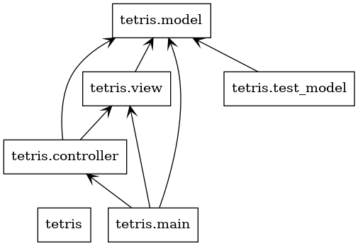
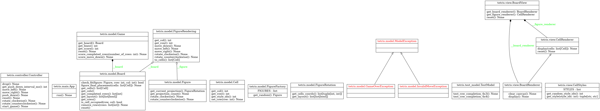

# Tetris

## Run the app

There is no pre-packaged version as of now, so the only way to launch the app is to run its code. This is quite easy though, most likely you already have Python installed in your machine. However you'll need a couple of more things: Tcl/Tk and tkinter. Tcl is a programming language and Tk is its "toolkit" for rapid GUI apps development. Tkinter is nothing else but a Python library, which wraps Tcl/Tk calls into Python objects.

The installation of these components depends on your system. 

### MacOS

Unfortunately Tcl version pre-installed with Mac OS is way too old. Most likely you'll have 8.5.9, but we need something better, like 8.6.14.

The process:

1. Install Tcl/Tk
    1. Start Tcl console `tclsh`
    2. Type `info patchlevel`
        * If you see "8.6.14" (generally speaking 8.6.x), you're good and can skip the rest of Tcl installation.
    3. Run `brew install tcl-tk`
    4. Restart console and check Tcl version again. Expected to be "8.6.14" or above.
2. Install Python-Tk
    1. Run `brew install python-tk`
    2. To check tkinter you might want to use the Python code fragment below
3. Create Python virtual environment (not necessary)
    1. python3 -m venv .venv
    2. source ./.venv/bin/activate
4. Start the app
    1. In terminal window with active virtual environment type `python3 main.py`

```
# Check Tk-interface (expected to return your new Tcl version "8.6.14")
import tkinter
tcl = tkinter.Tcl()
print(tcl.call(“info”, “patchlevel”))
```

### Debian Linux / ChromeOS

1. Check you Python version - type `python` in terminal. Excected to be "3.11" or something above 3.9.
2. Run `sudo apt-get install python3.11-tk` for your Python version ("3.11" here).

Most likely it will be enough. If no, use the MacOS procedure for troubleshooting (check Tcl version, upgrade if necessary, check `tkinter` using the Python code fragment above, re-install if necessary).

### Python modules

```
# Create a virtual environment if you haven't yet
python -m venv .venv

# Active it
source ./.venv/bin/activate

# Install Python dependencies
pip install -r requirements.txt
```

### Start the app

You can use or [start_local.sh](./start_local.sh), either just `python main.py`

```
bash ./start_local.sh

# or
# python main.py
```

# Reverse engineer the code

Install https://www.graphviz.org/ and https://pypi.org/project/pylint/

```
### Graphviz ###

# For Linux
sudo apt install graphviz

# For Mac OS
brew install graphviz

### Pylint ###

# Create a virtual environment if you haven't yet
python -m venv .venv

# Active it
source ./.venv/bin/activate

# Install libs
# pip install graphviz
pip install pylint
```

Generate UML diagrams - pyreverse will create `classes.png` and `packages.png` in the `diags` folder.

```
# mkdir diags

pyreverse ./ --output png --output-directory ./diags --module-names y
```





# Tetris AI co-pilot

This game of Tetris is equipped with AI co-pilot powered by Google AI.

* Google AI (for small projects)
    * Google AI Studio https://aistudio.google.com/
    * API reference https://ai.google.dev/api
* Google Vertex AI (for enterprise deployments)
    * Vertex AI Studio https://console.cloud.google.com/vertex-ai/
    * [Generative AI on Vertex AI docs](https://cloud.google.com/vertex-ai/generative-ai/docs/start/quickstarts/quickstart-multimodal?hl=en)
* Gemini AI docs
    * [Gemini API](https://ai.google.dev/gemini-api/docs)
    * [Gemini cookbook](https://github.com/google-gemini/cookbook)

## Authentication

Take a look at [Authentication.ipynb](https://github.com/google-gemini/cookbook/blob/main/quickstarts/Authentication.ipynb) - it expains how to start with Google AI APIs.

Basically, generate new API key in https://aistudio.google.com/app/apikey

The application reads API key from `GOOGLE_AI_APIKEY` environment variable. You might want to modify [start_local-sample.sh](./start_local-sample.sh), put the API key there and save it as `start_local.sh`

The same with the [.env-sample](./.env-sample) - if you're thinking of using Jupyter notebooks, please put your Google AI API key there and rename it to `.env`

# Ideas

1. Multi-turn interactions (see [here](https://github.com/google-gemini/cookbook/blob/main/quickstarts/Prompting.ipynb)). Basically Tetris is nothing else but a char, where the "gravity" makes it move, pushing a piece down every second, and the player is its counterpart.
2. Add "move left", "move right", etc. as tools in https://github.com/google-gemini/cookbook/blob/main/quickstarts/Function_calling.ipynb
3. Use multimodel capabilities of Gemini - show it an image of the Tetris board and ask about the next move.